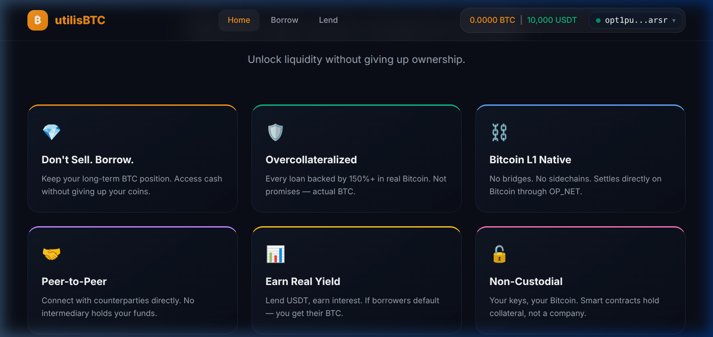
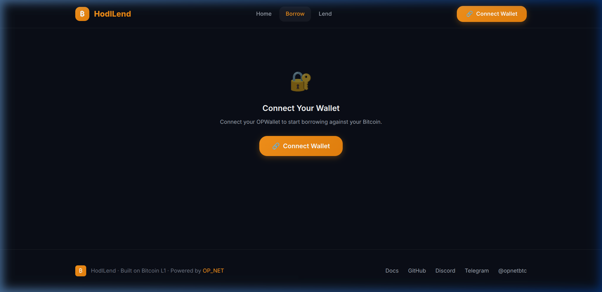
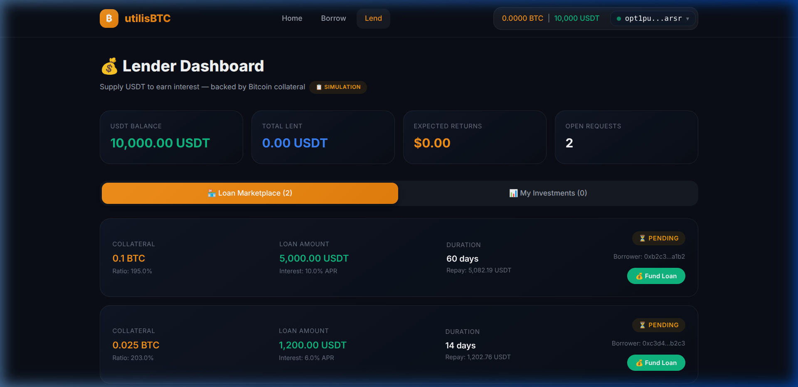

# utilisBTC

> **Bitcoin-Collateralized Lending on Layer 1 — Powered by OP_NET**

Borrow stablecoins against your BTC. Lend USDT and earn yield. No banks. No bridges. Just Bitcoin.

🌐 **Live:** [utilis-btc.vercel.app](https://utilis-btc.vercel.app)  
📜 **Contract:** `opt1sqrpxenjta0hgpdzr32jc6gucr3llwv6scvn0p5ha` (OP_NET Testnet)

## Demo

### Landing Page


### Why utilisBTC


### Borrower Dashboard


### Lender Dashboard


---

## What is utilisBTC?

utilisBTC is a trustless peer-to-peer lending protocol on Bitcoin L1. Lock BTC as collateral to borrow USDT, or lend surplus USDT to earn interest — all settling on-chain through OP_NET smart contracts.

**For Borrowers** — Need cash but don't want to sell your Bitcoin? Lock it as collateral and borrow stablecoins. Repay + interest to get your BTC back.

**For Lenders** — Put idle USDT to work. Fund BTC-backed loans and earn interest. If borrowers default, you claim their collateral.

## Features

- 🔒 **150% overcollateralized** — every loan backed by real BTC
- ⛓️ **Bitcoin L1 native** — settles directly on Bitcoin via OP_NET
- 🤝 **Peer-to-peer** — no intermediary holds your funds
- 🔓 **Non-custodial** — smart contracts hold collateral, not a company
- 📊 **Flexible terms** — 7 to 365 day durations, custom interest rates
- 💰 **2% platform fee** on interest earned

## Smart Contract

The lending contract is written in **AssemblyScript**, compiled to **WebAssembly**, and deployed on OP_NET testnet. It extends the OP20 token standard.

| Method | Description |
|--------|-------------|
| `createLoan` | Borrower creates a loan request (collateral, amount, duration, rate) |
| `fundLoan` | Lender funds a pending loan |
| `repayLoan` | Borrower repays and unlocks collateral |
| `liquidateLoan` | Lender seizes collateral after loan expires |
| `cancelLoan` | Borrower cancels an unfunded loan |
| `getLoan` | Read loan details |
| `getLoanCount` | Get total number of loans |

### Build the Contract

```bash
cd contract
npm install
npm run build:lending
# Output: contract/build/utilisBTC.wasm
```

## Tech Stack

| Layer | Technology |
|-------|-----------|
| Frontend | React 18 + Vite |
| Styling | Vanilla CSS (custom design system) |
| Smart Contract | AssemblyScript → WASM (OP_NET) |
| Wallet | OPWallet browser extension |
| Network | OP_NET Bitcoin L1 (testnet) |
| Deployment | Vercel |

## Getting Started

### Prerequisites
- Node.js 18+
- [OPWallet](https://chromewebstore.google.com/detail/opwallet/pmbjpcmaaladnfpacpmhmnfmpklgbdjb) browser extension
- Test BTC from [faucet.opnet.org](https://faucet.opnet.org)

### Install & Run

```bash
# Install frontend dependencies
npm install

# Create .env with contract address
cp .env.example .env
# Edit .env and add your deployed contract address

# Start dev server
npm run dev
```

Open [http://localhost:5173](http://localhost:5173) in your browser.

### Environment Variables

| Variable | Description |
|----------|-------------|
| `VITE_UTILISBTC_CONTRACT` | Deployed utilisBTC contract address |
| `VITE_USDT_TOKEN` | USDT token contract address (optional) |

## Project Structure

```
├── contract/                    # Smart contract (AssemblyScript)
│   ├── src/lending/
│   │   ├── utilisBTC.ts         # Lending contract
│   │   └── index.ts            # Entry point
│   ├── build/utilisBTC.wasm     # Compiled contract
│   └── abis/utilisBTC.abi.json  # Generated ABI
├── src/                         # Frontend (React)
│   ├── App.jsx                  # Routes & layout
│   ├── index.css                # Design system
│   ├── components/
│   │   ├── Hero.jsx             # Landing hero
│   │   ├── Stats.jsx            # Why utilisBTC section
│   │   ├── HowItWorks.jsx      # Feature explainer
│   │   ├── CTASection.jsx       # Bottom call-to-action
│   │   ├── BorrowerDashboard.jsx
│   │   ├── LenderDashboard.jsx
│   │   ├── CreateLoanModal.jsx
│   │   ├── LendModal.jsx
│   │   └── WalletButton.jsx
│   ├── context/
│   │   └── WalletContext.jsx    # OPWallet integration
│   └── utils/
│       ├── constants.js         # Config & params
│       ├── opnetProvider.js     # OP_NET RPC provider
│       ├── formatters.js        # Formatting utilities
│       └── lendingEngine.js     # Lending simulation
├── .env.example                 # Environment template
└── vercel.json                  # SPA routing config
```

## How It Works

1. **Connect** your OPWallet (testnet)
2. **Choose your role:**
   - 🏦 **Borrower** — Lock BTC → Borrow USDT → Repay to unlock
   - 💰 **Lender** — Browse requests → Fund loans → Earn interest
3. **On-chain settlement** — all logic executes via the deployed smart contract

## Links

- [OP_NET](https://opnet.org) · [Developer Docs](https://docs.opnet.org) · [OPWallet](https://chromewebstore.google.com/detail/opwallet/pmbjpcmaaladnfpacpmhmnfmpklgbdjb)
- [Discord](https://discord.com/invite/opnet) · [Telegram](https://t.me/opnetbtc) · [Twitter](https://x.com/opnetbtc)

## License

MIT

---

**#opnetvibecode** · Built on Bitcoin L1 · Powered by OP_NET
